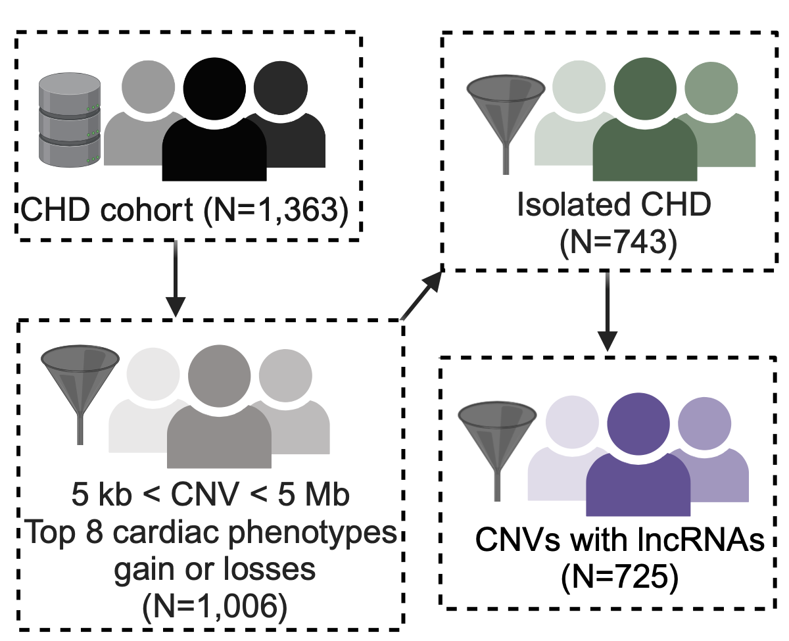

# Environment Setup

This is an [R Markdown](http://rmarkdown.rstudio.com) Notebook for Supplemental Script 1A. This Notebook will provide an overview of the data and show the filtering process that was used for patients analyzed in the network analysis.

```{r Packages_directory, message=FALSE, warning=FALSE}
# Load necessary libraries for data manipulation and visualization
library(tidyr)          # Functions for creating tidy data
library(purrr)          # Make functional programming easier and more accessible in R
library(dplyr)          # Data wrangling
library(stringr)        # String manipulation
library(ggplot2)        # Graphs
library(forcats)        # Factors manipulation
library(Cairo)          # Creates high quality PDFs for publication
library(GenomicRanges)  # Genomic ranges for overlapping genes
library(biomaRt)        # Gene annotations
library(networkD3)      # Network diagrams, i.e., Sankey plot
library(data.table)     # Data manipulation
library(rtracklayer)    # GTF file handling
library(circlize)       # Circos plots
library(rmdformats)     # RMarkdown formatting
library(knitr)          # For creating tables in R Markdown
library(skimr)          # For detailed summaries
library(kableExtra)     # For table styling
library(tibble)         # For adding rows to tibbles/data frames
library(readr)          # Efficient data import and export
library(R.utils)        # Provides gzip compression utilities
library(htmlwidgets)    # Saves plot as HTML
library(webshot2)       # Captures HTML file as PDF
library(chromote)       # Headless Chrome Remote Interface
library(here)           # File path management

# Define a custom option to control chunk evaluation
options(eval_chunks = TRUE)

# Set the global chunk option based on the custom option
knitr::opts_chunk$set(
  eval = getOption("eval_chunks"),
  fig.width = 12,
  fig.height = 8,
  out.width = '80%',
  fig.align = 'center',
  echo = TRUE,
  message = FALSE,
  warning = FALSE
)

# Set the current working directory for the 'here' package
here::i_am("Penaloza_CCVM_Notebook_1A.Rmd")

# Source the shared functions
source(here::here("Penaloza_Shared_Scripts.R"))

# Ensure Chrome is available for the webshot2 package
if (!ensureChrome()) {
  stop("Google Chrome is required for this script to run. Please install it or specify the path.")
}
```


# Preprocessing CCVM data from JAHA Publication

> "A Multicenter Analysis of Abnormal Chromosomal Microarray Findings in Congenital Heart Disease" by Landis et al., 2023 J Am Heart Association (doi: 10.1161/JAHA.123.029340) (PMID: 37681527)

```{r Load RDS, message=FALSE, warning=FALSE}
# Load the main CCVM dataset for analysis
ccvm_data <- readRDS(file.path(getwd(), "InputData/02032023_CCVM_abnormalEcho.RDS"))

# Display the structure of the data to understand its composition
str(ccvm_data)
```

```{r Display CCVM data frame, message=FALSE, warning=FALSE}
# Display the first few rows of the CCVM data as a nicely formatted table
style_kable(head(ccvm_data), caption = "Summary of the first few rows of the data")
```

```{r Summarize CCVM data frame, message=FALSE, warning=FALSE}
# Detailed summary using skimr
skim(ccvm_data)
```

## Summary of cohort

We will generate various levels of summary for the CCVM cohort.

### Syndromic vs. non-syndromic CHD

Summarize the number of distinct patient IDs (ID) grouped by primary condition (Syndrome_A) and if it exists, a secondary condition (Syndrome_B). 

```{r Syndromic Patients, message=FALSE, warning=FALSE}
# Generate the summary using dplyr and add a total row
syndrome_counts <- ccvm_data %>%
  group_by(Syndrome_A, Syndrome_B) %>%
  summarise(Count = n_distinct(ID), .groups = 'drop') %>%
  arrange(desc(Count)) %>%
  # Use tibble::add_row() to append a total row with the sum of counts
  add_row(Syndrome_A = "Total", Syndrome_B = "", Count = sum(.$Count))

# Display the counts as a table
style_kable(syndrome_counts, caption = "Counts of Syndromic Patients")
```


### Summary of CHD classification across the cohort

Summarize the CHD classification across the cohort by first removing duplicates and then concatenating unique diagnoses for each subject. 

```{r CHD Classification, message=FALSE, warning=FALSE}
# Remove duplicates if necessary
unique_data <- ccvm_data %>%
  distinct(ID, Hierarchical_Level_3_diagnosis)

# Concatenate unique diagnoses
chd_combined <- unique_data %>%
  group_by(ID) %>%
  summarise(CHD_Classification = paste(unique(Hierarchical_Level_3_diagnosis), collapse = "; "), .groups = 'drop')

# Summarize the counts for unique subjects based CHD classification
summary_chd <- chd_combined %>%
  group_by(CHD_Classification) %>%
  summarise(Count = n(), .groups = 'drop') %>%
  arrange(desc(Count)) %>%
  # Use tibble::add_row() to append a total row with the sum of counts
  add_row(CHD_Classification = "Total", Count = sum(.$Count))

# Display the counts as a table
style_kable(summary_chd, caption = "Counts of CNV and LOH")
```

### Breakdown of CNV findings

Summarize the counts of different CNV types by removing duplicates and grouping the data by CNV type and value. 

```{r CNV Findings, message=FALSE, warning=FALSE}
# Summarize counts of types of CNV
cnv_counts <- ccvm_data %>%
  distinct(ID, Chr_Hg19, Start_Hg19, End_Hg19, CNV_type, CNV_value, LOH_only) %>%
  dplyr::count(CNV_type, CNV_value, name = "Count") %>%
  arrange(desc(Count)) %>%
  # Use tibble::add_row() to append a total row with the sum of counts
  add_row(CNV_type = "Total", CNV_value = "", Count = sum(.$Count))

# Display the counts as a table
style_kable(cnv_counts, caption = "Counts of CNV and LOH")
```

While most subjects have a single CNV, many have two or more.

```{r CNV Counts Per Patient, message=FALSE, warning=FALSE}
# Summarize counts of types of CNV
cnv_counts_per_patient <- ccvm_data %>%
  distinct(ID, Chr_Hg19, Start_Hg19, End_Hg19, CNV_type, CNV_value) %>%
  group_by(ID) %>%
  summarise(CNV_Count = n(), .groups = 'drop') %>%
  arrange(desc(CNV_Count)) 

# Categorize the counts
cnv_category_counts <- cnv_counts_per_patient %>%
  mutate(CNVs = case_when(
    CNV_Count == 1 ~ "Single",
    CNV_Count == 2 ~ "Two",
    CNV_Count >= 3 ~ "Three or more"
  )) %>%
  dplyr::count(CNVs, name = "Count") %>%
  arrange(desc(Count)) %>%
  add_row(CNVs = "Total", Count = sum(.$Count))

# Display the counts as a table
style_kable(cnv_category_counts, caption = "Counts of patients with 1, 2 or 3 or more CNVs")
```

Count the occurrences of each CNV type for each unique subject and summarize these counts into a combined format for each subject. The results are further summarized by counting the unique combinations of CNV types across subject.

```{r Detailed Breakdown of CNV Findings - Unique, message=FALSE, warning=FALSE}
# Count occurrences of each CNV_type for each ID
counted_data <- ccvm_data %>%
  distinct(ID, Chr_Hg19, Start_Hg19, End_Hg19, CNV_type, CNV_value) %>%
  group_by(ID, CNV_type) %>%
  summarise(Count = n(), .groups = 'drop')

# Concatenate the results with the counts
cnv_sum <- counted_data %>%
  group_by(ID) %>%
  summarise(Combination = paste(CNV_type, "(", Count, ")", sep = "", collapse = "; "), .groups = 'drop')

# Summarize the counts for unique subjects based on the concatenated combinations of A, B, and C
summary_counts <- cnv_sum %>%
  group_by(Combination) %>%
  summarise(Count = n(), .groups = 'drop') %>%
  arrange(desc(Count)) %>%
  # Use tibble::add_row() to append a total row with the sum of counts
  add_row(Combination = "Total", Count = sum(.$Count))

# Display the counts as a table
style_kable(summary_counts, caption = "Counts of CNV and LOH")
```

### Detailed breakdown of CNV types and values

Concatenate unique combinations of CNV types and values for each subject, and then summarize the counts of these combinations across the cohort.

```{r CNV Types and Values - Unique, message=FALSE, warning=FALSE}
# Concatenate the unique combinations of A, B, and C for each subject
combined_data <- ccvm_data %>%
  distinct(ID, Chr_Hg19, Start_Hg19, End_Hg19, CNV_type, CNV_value) %>%
  group_by(ID) %>%
  summarise(Combination = paste(unique(paste(CNV_type, CNV_value, sep = ", ")), collapse = "; "), .groups = 'drop')

# Summarize the counts for unique subjects based on the concatenated combinations of A, B, and C
summary_counts <- combined_data %>%
  group_by(Combination) %>%
  summarise(Count = n(), .groups = 'drop') %>%
  arrange(desc(Count)) %>%
  # Use tibble::add_row() to append a total row with the sum of counts
  add_row(Combination = "Total", Count = sum(.$Count))

# Display the counts as a table
style_kable(summary_counts, caption = "Counts of CNV and LOH")
```

## Data Wrangling of the CHD Cohort

The CCVM data needs to undergo several steps to filter and organize the dataset for final analysis.



### *STEP 1: Filter ROH* 

The first step in filtering removes all ROH values from the dataset.

```{r Filter ROH, message=FALSE, warning=FALSE}
# Count the number of rows where CNV_type is "ROH"
num_roh <- sum(ccvm_data$CNV_type == "ROH")

# Drop all rows where CNV_type is ROH
ccvm_data_filtered <- ccvm_data %>%
  filter(CNV_type != "ROH")

# Record results of filtering
logMessage(paste0("A total of ", num_roh, " ROH regions were removed. ",
                  nrow(ccvm_data_filtered), " CNVs remain."))
```

### *STEP 2: Filter on CNV region size*

Calculate summary statistics for CNV sizes, including the mean, standard deviation, and percentiles. The results are formatted for readability, including the conversion of complete rates to percentages and numeric values to strings without trailing zeros. The summary is presented in a tidy format, with additional rows indicating counts of very small (≤ 5 KB) and very large (≥ 5 MB) CNVs.

```{r CNV size metrics, message=FALSE, warning=FALSE}
# Calculate summary statistics manually
summary_stats <- ccvm_data_filtered %>%
  summarise(
    Missing = sum(is.na(Size_Hg19)),
    `Complete Rate` = mean(!is.na(Size_Hg19)) * 100,
    Mean = mean(Size_Hg19, na.rm = TRUE),
    `Std Dev` = sd(Size_Hg19, na.rm = TRUE),
    Min = min(Size_Hg19, na.rm = TRUE),
    `25th Percentile` = quantile(Size_Hg19, 0.25, na.rm = TRUE),
    Median = median(Size_Hg19, na.rm = TRUE),
    `75th Percentile` = quantile(Size_Hg19, 0.75, na.rm = TRUE),
    Max = max(Size_Hg19, na.rm = TRUE)
  )

# Convert numeric values to strings without trailing zeros
summary_stats <- summary_stats %>%
  mutate(across(where(is.numeric), ~ format(.x, trim = TRUE, scientific = FALSE, digits = 5)))

# Convert complete rate to a percentage
summary_stats <- summary_stats %>%
  mutate(`Complete Rate` = paste0(`Complete Rate`, "%"))

# Create a tidy data frame with each row as a variable
tidy_summary <- summary_stats %>%
  pivot_longer(everything(), names_to = "Metric", values_to = "Size (MB)")

# Create a tidy data frame with each row as a variable
tidy_summary <- summary_stats %>%
  pivot_longer(everything(), names_to = "Metric", values_to = "Size (MB)")

# Ensure the `Size (MB)` column is character type
tidy_summary <- tidy_summary %>%
  mutate(`Size (MB)` = as.character(`Size (MB)`))

# Add additional rows for small and large CNVs
counts <- ccvm_data_filtered %>%
  summarise(
    small_CNV = as.character(sum(Size_Hg19 <= 0.005)),
    large_CNV = as.character(sum(Size_Hg19 >= 5))
  )
tidy_summary <- tidy_summary %>%
  add_row(Metric = "Too small (<= 5 KB)", 'Size (MB)' = counts$small_CNV) %>%
  add_row(Metric = "Too big (>= 5 MB)", 'Size (MB)' = counts$large_CNV)

style_kable(tidy_summary, caption = "CNV Region Summary Metrics")
```

Remove large CNVs (>5MB), representative of aneuplodies and filter out small CNVs (<5KB). Final data set contains CNVs ranging from 5KB to 5MB.

```{r CNV Size Filter, message=FALSE, warning=FALSE}
# Count the number of CNVs to filter out
num_small <- sum(ccvm_data_filtered$Size_Hg19 < 0.005)
num_large <- sum(ccvm_data_filtered$Size_Hg19 > 5)

# Drop all rows where size is too small or large
ccvm_data_filtered <- ccvm_data_filtered %>%
  filter(Size_Hg19 >= 0.005, Size_Hg19 <= 5)

# Record results of filtering
logMessage(paste0("A total of ", num_small + num_large, " regions were removed. ",
                  nrow(ccvm_data_filtered), " CNVs remain."))
```

### *STEP 3: Remove pseudoautosomal CNVs*

The highly variable pseudoautosomal regions (PARs) on the X chromosome were removed

```{r PAR CNV Filter, message=FALSE, warning=FALSE}
# Count the number of PAR regions
num_par <- sum(ccvm_data_filtered$Chr_Hg19 == "X/Y")

# Filter out sex chromosomes (X and Y)
ccvm_data_filtered <- ccvm_data_filtered %>%
  filter(Chr_Hg19 != "X/Y")

# Record results of filtering
logMessage(paste0("A total of ", num_par, " PAR (X/Y) regions were removed. ",
                  nrow(ccvm_data_filtered), " CNVs remain."))
```

### *STEP 4: Focus analysis on isolated CHD*

Focus the analysis on isolated CHD by categorizing patients as either syndromic or non-syndromic based on the Syndrome_A column. Summarize the number of distinct patients and total CNVs in each category, including a total row for both. 

```{r CHD Category summary, message=FALSE, warning=FALSE}
# Add a Category column to capture whether patient is syndromic
ccvm_data_filtered <- ccvm_data_filtered %>%
  mutate(Category = ifelse(Syndrome_A == "No", "Non-syndromic", "Syndromic"))

# Summarise the number of distinct patients and total CNVs in each category
syndromic_summary <- ccvm_data_filtered %>%
  group_by(Category) %>%
  summarise(
    Distinct_Patients = n_distinct(ID),
    Total_CNVS = n(),
    .groups = 'drop'
  ) %>%
  add_row(Category = "Total", Distinct_Patients = sum(.$Distinct_Patients),
          Total_CNVS = sum(.$Total_CNVS))

style_kable(syndromic_summary, caption = "CHD Category")
```

Summarize the counts of unique patients for each CHD diagnosis (Diagnosis), broken down by syndromic and non-syndromic categories. 

```{r CHD Classification by CHD Category, message=FALSE, warning=FALSE}
# Summarize the unique counts for each category by Hierarchical_Level_3_diagnosis
ccvm_data_filtered <- ccvm_data_filtered %>%
  dplyr::rename("Diagnosis" = "Hierarchical_Level_3_diagnosis")

syndromic_summary <- ccvm_data_filtered %>%
  group_by(Diagnosis) %>%
  summarise(
    `Non-syndromic` = n_distinct(ID[Category == "Non-syndromic"]),
    Syndromic = n_distinct(ID[Category == "Syndromic"]),
    Total = n_distinct(ID),
    .groups = 'drop'
  ) %>% 
  arrange(desc(Total))

style_kable(syndromic_summary, caption = "CHD Category")
```

#### Supplemental Figure 1: Counts of Syndromic and Non-syndromic Patients by Diagnosis. 

Create a supplemental figure (*Supplemental Figure 1*) that visually represents the counts of syndromic and non-syndromic patients for each CHD diagnosis. 

```{r Supplemental Figure 1, message=FALSE, warning=FALSE}
# Calculate total counts for each Diagnosis
total_counts <- syndromic_summary %>%
  rowwise() %>%
  mutate(Total = sum(c_across(`Non-syndromic`:Syndromic)))

# Reorder the Diagnosis factor based on total counts
syndromic_summary$Diagnosis <- factor(syndromic_summary$Diagnosis, levels = total_counts %>% arrange(Total) %>% pull(Diagnosis))

# Pivot the data to a long format for ggplot2
syndromic_long <- syndromic_summary %>%
  pivot_longer(cols = c(`Non-syndromic`, Syndromic), names_to = "Category", values_to = "Count")

# Relevel the Category factor to ensure "Non-syndromic" comes first
syndromic_long$Category <- factor(syndromic_long$Category, levels = c("Non-syndromic", "Syndromic"))

# Create the plot
FigS1 <- ggplot(syndromic_long, aes(x = Diagnosis, y = Count, fill = Category)) +
  geom_bar(stat = "identity", 
           position = position_stack(reverse = TRUE),
           color = "grey60") +
  geom_text(aes(label = Count), 
            position = position_stack(vjust = 0.5, reverse = TRUE), 
            size = 3, 
            check_overlap = TRUE) +
  coord_flip() +
  labs(y = "Count", x = "Diagnosis",
       title = "Counts of Syndromic and Non-syndromic Patients by Diagnosis") +
  theme(plot.title = element_text(hjust = 0.5, face = "bold", size = 15,
                                  margin = margin(b = 10)),  # Center and bold title with margin
        axis.title = element_text(size = 13, face = "bold"),
        axis.title.y = element_blank(), 
        axis.text = element_text(size = 11, color = "black"),
        panel.background = element_rect(fill = "white", 
                                        colour = "black", 
                                        linewidth  = 0.5, 
                                        linetype = "solid"),
        panel.grid.major = element_blank(), 
        panel.grid.minor = element_blank(),
        legend.position = c(0.8, 0.2),
        legend.key = element_rect(fill = "white", colour = NA),
        plot.margin = margin(0.5, 0.5, 0.5, 0.5, "in")) +  # Set 0.5-inch margins on all sides
  scale_fill_manual(values = c("Non-syndromic" = "skyblue", "Syndromic" = "grey80"))

# Save the plot as a high-quality PDF
ggsave("Figures/Figure_S1_CHD_Subtypes_by_CHD_Category.pdf",
       plot = FigS1, width = 8.5, height = 6, units = "in", dpi = 300,
       device = cairo_pdf)

# Print histogram
print(FigS1)
```

>*Supplemental Figure 1: Counts of Syndromic and Non-syndromic Patients by Diagnosis.* This bar plot visualizes the distribution of syndromic and non-syndromic patients across various CHD diagnoses. Each bar represents the total number of patients within a specific diagnosis, with the count of non-syndromic patients shown in sky blue and syndromic patients in grey. The bars are stacked, allowing for easy comparison of the relative proportions of syndromic and non-syndromic cases within each diagnosis. The diagnoses are listed on the y-axis, while the total patient count is shown on the x-axis. This visualization highlights the variation in syndromic and non-syndromic occurrences across different CHD categories in the study cohort.

Filter out syndromic patients from the dataset to focus on non-syndromic cases. 

```{r Syndromic Filter, message=FALSE, warning=FALSE}
# Count the number of syndromic patients
num_syndromic <- sum(ccvm_data_filtered$Category == "Syndromic")
num_nonsyndromic <- sum(ccvm_data_filtered$Category == "Non-syndromic")

# Filter out syndromic cases
ccvm_data_filtered <- ccvm_data_filtered %>%
  filter(Category == "Non-syndromic")

# Record results of filtering
logMessage(paste0("A total of ", num_syndromic, " syndromic patient CNVs were removed. ",
                  nrow(ccvm_data_filtered), " non-syndromic patients CNVs remain."))
```

### *STEP 5: Top eight categories of CHD diagnosis.*

Identify the top 8 categories of CHD diagnosis from the Diagnosis column (Hierarchical_Level_3_diagnosis) and ensure they are correctly factored. Filter the data to focus on these top categories, summarizing the number of patients included and excluded from the analysis. Results are shown in *Figure 2A*.

```{r Plot Figure 2A, message=FALSE, warning=FALSE}
# Select ID and diagnosis columns and remove duplicates
CHD_Class <- ccvm_data_filtered %>% 
  dplyr::select(ID, Diagnosis) %>% 
  distinct()

# Identify the top 8 occuring classes and ensure they are factorized:
top_classes <- CHD_Class %>%
  dplyr::count(Diagnosis, sort = TRUE) %>%
  top_n(8, wt = n) %>%
  pull(Diagnosis) %>%
  factor(levels = .)

# Ensure the data is correctly filtered and prepared
ccvm_data_filtered <- ccvm_data_filtered %>%
  mutate(keep = ifelse(Diagnosis %in% levels(top_classes), "Yes", "No"))

# Get counts of values for "No" and "Yes" in the keep column
keep_counts <- ccvm_data_filtered %>%
  summarise(
    keep_yes = n_distinct(ID[keep == "Yes"]),
    keep_no = n_distinct(ID[keep == "No"])
  )

# Create summary table of non-syndromic patients for plotting
nonsyndromic_summary <- ccvm_data_filtered %>%
  group_by(Diagnosis, keep) %>%
  summarise(Count = n_distinct(ID), .groups = 'drop') %>%
  arrange(desc(Count))

# Create the plot
Fig2A <- ggplot(nonsyndromic_summary, 
             aes(x = fct_reorder(Diagnosis, Count), y = Count, fill = keep)) +
  geom_bar(stat = "identity", color = "grey60",alpha=0.5) + 
  geom_text(aes(label = Count), position = position_stack(vjust = 0.5),
            size = 3, color = "black", check_overlap = TRUE) + 
  coord_flip() +
  ggtitle(paste0("CCVM Filtered Cohort of ", sum(nonsyndromic_summary$Count), 
                 " Syndromic CHD Patients")) +
  theme(plot.title = element_text(hjust = 0.95, face = "bold", size = 10,
                                  margin = margin(b = 10)),  # Center and bold title with margin
        axis.title = element_text(size = 9, face = "bold"),
        axis.title.y = element_blank(), 
        axis.text = element_text(size = 8, color = "black"),
        panel.background = element_rect(fill = "white", 
                                        colour = "black", 
                                        size = 0.5, linetype = "solid"),
        panel.grid.major = element_blank(), 
        panel.grid.minor = element_blank(),
        legend.position = c(0.7, 0.2),
        legend.key = element_rect(fill = "white", colour = NA),
        plot.margin = margin(0.1, 0.1, 0.1, 0.1, "in")) +  # Set 0.5-inch margins on all sides)  +
  scale_fill_manual(name = "Patients Included", 
                    breaks = c("No", "Yes"),
                    labels = c(paste0("No (", keep_counts$keep_no, ")"),
                               paste0("Yes (", keep_counts$keep_yes, ")")),
                    values = c("grey95", "skyblue"),
                    guide = guide_legend(reverse = TRUE))

# Save the plot as a high-quality PDF
ggsave("Figures/Figure_2A_Syndromic_CHD_Subtypes.pdf",
       plot = Fig2A, width = 4, height = 4, units = "in", dpi = 300,
       device = cairo_pdf)

# Print histogram
print(Fig2A)
```

>*Figure 2A: Distribution of Non-Syndromic CHD Patients Across Top Diagnoses.* This bar plot visualizes the distribution of non-syndromic congenital heart disease (CHD) patients within the top 8 most common diagnoses in the study cohort. Diagnoses are ordered by the number of patients, with bars representing the total number of patients for each diagnosis. The bars are color-coded to indicate whether patients were included (“Yes”) or excluded (“No”) from the analysis based on their diagnosis. The “Yes” category represents the top 8 CHD diagnoses, shown in sky blue, while the “No” category represents diagnoses not in the top 8, shown in grey. 

Create final filtered CCVM dataset - filter the dataset to retain only non-syndromic patients within the top 8 CHD diagnosis categories. 

```{r Final Filter, message=FALSE, warning=FALSE}
# Filter on top 8 diagnosis
ccvm_data_filtered <- ccvm_data_filtered %>%
  filter(keep == "Yes")

# Record results of filtering
logMessage(
  paste0(
    "A total of ", keep_counts$keep_no, " non-syndromic patients were removed. ",
    keep_counts$keep_yes, " non-syndromic patients with a total of ",
    nrow(ccvm_data_filtered), " CNVs remain. Patients represent 8 different CHD classifications: ",
    paste(levels(top_classes), collapse = ", ")
  )
)
```


### Plot CNV size distributions

This image (*Supplemental Figure 2*) illustrates the distribution of CNV sizes for isolated CHD patients, with sizes converted to kilobases (Kb). The histogram is faceted by CNV_value and customized with specific colors. 

```{r plot final CNV size histogram, message=FALSE, warning=FALSE}
# Convert Size_Hg19 from Mb to Kb
cnv_sizes <- ccvm_data_filtered %>%
  mutate(Size_Kb = Size_Hg19 * 1000)

# Create the histogram with facets for each CNV_value and customized colors
FigS2 <- ggplot(cnv_sizes, aes(x = Size_Kb, fill = CNV_value)) +
  geom_histogram(binwidth = 100, color = "grey20", alpha = 0.7) +
  facet_wrap(~ CNV_value, ncol = 1) +
  scale_fill_manual(values = c("darkred", "dodgerblue","darkblue")) +
  labs(x = "Size (Kb)", y = "Frequency", title = "CNV Sizes across Isolated CHD Cohort") +
  theme_minimal() +
  theme(
    plot.title = element_text(hjust = 0.5, face = "bold", size = 15, margin = margin(b = 10)),
    axis.title = element_text(size = 13, face = "bold"),
    axis.text = element_text(size = 11),
        panel.background = element_rect(fill = "white", 
                                        colour = "black", 
                                        linewidth = 0.5,
                                        linetype = "solid"),
        panel.grid.major = element_blank(), 
        panel.grid.minor = element_blank(),
    axis.line = element_line(color = "black"),
    plot.margin = margin(0.5, 0.5, 0.5, 0.5, "in"),
    strip.text = element_text(size = 14, face = "bold"),  # Set the font size for the facet titles
    legend.position = "none"  # Remove legend
  ) 

# Save the plot as a high-quality PDF
ggsave("Figures/Figure_S2_CNV_size_histogram.pdf", 
       plot = FigS2, width = 8.5, height = 11, units = "in", dpi = 300, 
       device = cairo_pdf)

# Display the plot
print(FigS2)
```

>*Supplemental Figure 2: CNV Size Distributions Across Isolated CHD Patients.* This histogram illustrates the distribution of CNV sizes within the isolated CHD cohort. CNV sizes are measured in kilobases (Kb) and are displayed on the x-axis, while the frequency of each size range is shown on the y-axis. The histogram is faceted by CNV value, with each panel representing a different CNV type: duplication (red), heterozygous deletion (blue), and homozygous deletion (purple). This plot provides a detailed view of the variation in CNV sizes across the cohort, highlighting the most common size ranges within each CNV category.

### *STEP 6: Final data cleanup*

Perform final data cleanup by removing unnecessary columns, renaming and repairing column names, and creating a unique INDEX for each CNV entry by appending letters to duplicate IDs. The cleaned dataset is then saved as both a tab-delimited text file and an RDS file for future use.

```{r Final CCVM CMA Data, message=FALSE, warning=FALSE}
# Columns to remove
columns_to_remove <- c("Syndrome_A", "Syndrome_B", "LOH_only", "Echo_findings", "Category", "keep")

# Remove specified columns
cnv_data <- ccvm_data_filtered %>%
  dplyr::select(-all_of(columns_to_remove))

# Repair column namex
cnv_data <- cnv_data %>%
  dplyr::rename("CHD_genes_Chang" = "CHD_genes_Chang.x",
                "Size_Hg19_Mb" = "Size_Hg19")

# Create an INDEX field that appends a letter to duplicate IDs
cnv_data <- cnv_data %>%
  group_by(ID) %>%
  arrange(Chr_Hg19, Start_Hg19) %>%
  mutate(INDEX = paste0(ID, letters[row_number()])) %>%
  ungroup() %>%
  dplyr::select(INDEX, everything())  # Move INDEX to the first column
```

# CNV Liftover

CMA data from the CCVM cohort contains CNVs and their genomic locations on the GRCh37 (hg19) human reference genome. The 938 CNVs now need to be mapped to the current human geneome reference, GRCh38 (hg38), using a process termed "liftover".

## *STEP 1: Prepare CCVM hg19 data for liftover process*

The coordinates of the CNV are located in the "Chr_Hg19", "Start_Hg19" and "End_Hg19" fields. This process involves formatting chromosome names to match the hg19 reference genome, retrieving sequence information for hg19 and hg38, and creating the GRanges object with appropriate sequence levels and genome information. We will read it and convert it to a GRanges object.

```{r create genomic ranges object for CNVs, message=FALSE, warning=FALSE}
# Prepend "chr" to Chromosome to create hg19 formatted values, i.e., "1" = "chr1" 
cnv_hg19_tibble <- cnv_data %>%
  mutate(seqnames = paste0("chr", Chr_Hg19)) %>%
  dplyr::select(INDEX, seqnames, Start_Hg19, End_Hg19) %>%
  dplyr::rename("start" = "Start_Hg19", "end" = "End_Hg19") %>%
  mutate(width = end - start, strand = "*")

# Fetch the latest seqinfo for hg19 and hg38 and update GRanges object
seqinfo_hg19 <- getChromInfoFromUCSC("hg19") %>%
  filter(!grepl("_", chrom)) %>%  # Exclude alternative loci
  filter(!grepl("chrM", chrom))  # Exclude chrM
seqinfo_hg38 <- getChromInfoFromUCSC("hg38",map.NCBI = TRUE) %>%
  filter(!grepl("_", chrom)) %>%  # Exclude alternative loci
  filter(!grepl("chrM", chrom))  # Exclude chrM

# Convert to GRanges object
cnv_hg19_gr <- GRanges(cnv_hg19_tibble)
seqlevels(cnv_hg19_gr) <- seqinfo_hg19$chrom # Ensure seqlevels of cnv_gr match those of chrom_lengths
seqinfo(cnv_hg19_gr) <- Seqinfo(
  seqnames = seqinfo_hg19$chrom,
  seqlengths = seqinfo_hg19$size,
  genome = "hg19"
)
```

## *STEP 2: Download chain file from UCSC*

Download and prepare the chain file needed for liftover if it is not already available. The chain file is used to map genomic coordinates from the hg19 reference genome to hg38. The script downloads the compressed chain file, decompresses it, and then loads it into R for use in the liftover process.

```{r chain files for liftover, message=FALSE, warning=FALSE}
# Download chain file if not already present
chain_file <- "PublicData/UCSC_hg19ToHg38.over.chain"
if (!file.exists(chain_file)) {
  download.file("http://hgdownload.cse.ucsc.edu/goldenPath/hg19/liftOver/hg19ToHg38.over.chain.gz",
                destfile = paste0(chain_file, ".gz"))
  gunzip(paste0(chain_file, ".gz"))
}

# Load the chain file
chain <- import.chain(chain_file)
```

## *STEP 3: Liftover hg19 CNVs to hg38*

The liftover chain file was made using alignments of sequences between the two genome builds, that would have ranges from 100 bp to 500 bp. To minimize loosing an entire CNV if either the beginning or end of the range can not be lifted over, we will first split all CNV ranges into 500 bp chunks, perform the liftover, and then merge the results.

```{r hg19 to hg38 liftover}
# Step 1: Split the ranges into 500 bp chunks
split_ranges <- lapply(seq_along(cnv_hg19_gr), function(i) {
  seqname <- seqnames(cnv_hg19_gr)[i]
  start <- start(cnv_hg19_gr)[i]
  end <- end(cnv_hg19_gr)[i]
  index <- cnv_hg19_gr$INDEX[i]
  
  # Split into 500 bp chunks
  start_positions <- seq(start, end, by = 500)
  end_positions <- pmin(start_positions + 499, end)
  
  GRanges(seqnames = seqname,
          ranges = IRanges(start = start_positions, end = end_positions),
          INDEX = index)
})

split_gr <- unlist(GRangesList(split_ranges))

# Step 2: Perform the liftover
cnv_gr_hg38 <- liftOver(split_gr, chain)
seqlevels(cnv_gr_hg38) <- seqinfo_hg38$chrom # Ensure seqlevels of cnv_gr match those of chrom_lengths
seqinfo(cnv_gr_hg38) <- Seqinfo(seqnames = seqinfo_hg38$chrom, 
                                seqlengths = seqinfo_hg38$size, 
                                genome = "hg38")

# Step 3: Unlist the lifted CNVs to get a single GRanges object
cnv_gr_hg38_unlisted <- unlist(cnv_gr_hg38)

# Step 4: Split the GRanges object by the INDEX column
split_gr <- split(cnv_gr_hg38_unlisted, cnv_gr_hg38_unlisted$INDEX)

# Step 5: Use reduce() with min.gapwidth to merge ranges within 100,000 bp of each other
reduced_granges <- lapply(split_gr, function(gr) {
  reduced_gr <- GenomicRanges::reduce(gr, min.gapwidth = 100000)
  mcols(reduced_gr)$INDEX <- unique(gr$INDEX)
  return(reduced_gr)
})
  
# Step 6: Combine the reduced ranges back into a single GRanges object
cnv_hg38_gr <- unlist(GRangesList(reduced_granges))

# Step 7: Convert the GRanges object to a tibble
cnv_hg38_tibble <- as_tibble(cnv_hg38_gr) %>%
  dplyr::select(INDEX, everything())

# Step 8: Drop any lifted over CNVs that were less than 5000 bp
num_regions_too_short <- sum(cnv_hg38_tibble$width < 5000)
logMessage(
  paste(
    "Number of lifted regions less than 5,000 bp and dropped from results:",
    num_regions_too_short
  )
)
cnv_hg38_tibble <- cnv_hg38_tibble %>%
  filter(width >= 5000)
```

Summarize the results of the liftover process

```{r Liftover results summary}
# Step 1: Determine the number of unique INDEX values in the original and lifted-over files

# Unique INDEX values in the original file
unique_index_hg19 <- unique(mcols(cnv_hg19_gr)$INDEX)
num_unique_index_hg19 <- length(unique_index_hg19)

# Unique INDEX values in the lifted-over file
unique_index_hg38 <- unique(cnv_hg38_tibble$INDEX)
num_unique_index_hg38 <- length(unique_index_hg38)

# Step 2: Determine the number of INDEX values not lifted over
not_lifted_over <- setdiff(unique_index_hg19, unique_index_hg38)
num_not_lifted_over <- length(not_lifted_over)

# Display the results
logMessage(paste(
  "Number of unique CNVs in the original file:",
  num_unique_index_hg19
))
logMessage(paste(
  "Total number of CNV ranges in the lifted-over file:",
  length(cnv_hg38_gr)
))
logMessage(paste(
    "This number is higher than the original, as some of the lifted over ranges exceeded 10KB."
))
logMessage(
  paste(
    "Number of unique INDEX values in the lifted-over file:",
    num_unique_index_hg38
))
logMessage(
  paste(
    "Number of INDEX values not lifted over:",
    num_not_lifted_over
))
logMessage(paste(
      "INDEX values not lifted over:",
      paste(not_lifted_over, collapse = ", ")
))
```

## *STEP 4: Check the results of the liftover process*

The discrepancy between the number of original CNVs (938) and the number of lifted CNVs (979) after the liftover process can be explained by the fact that some CNVs are split into multiple segments during the liftover. This happens because certain regions of the genome may be restructured or reannotated in the newer genome build, resulting in CNVs that span these regions being split into new segments.

```{r View CNVs now split into multiple regions}
# Identify duplicated INDEX values
duplicated_indices <- cnv_hg38_tibble %>%
  group_by(INDEX) %>%
  filter(n() > 1) %>%
  arrange(INDEX)

# Display duplicated INDEX values and their ranges
duplicated_indices

# Display example samples
cnv_hg19_tibble %>%
  filter(INDEX %in% c("002-0008a", "009-0009a"))

cnv_hg38_tibble %>%
  filter(INDEX %in% c("002-0008a", "009-0009a"))

# Display example samples where liftover splits ranges

cnv_hg19_tibble %>%
  filter(INDEX %in% c("008-0017b", "005-0019a"))

cnv_hg38_tibble %>%
  filter(INDEX %in% c("008-0017b", "005-0019a"))
```

Check the results of the liftover process by identifying and counting duplicated INDEX values in the hg38 dataset. The script creates a table of duplicated indexes, ordered by the number of occurrences, to help identify any issues or patterns in the liftover results.

```{r check liftover results, message=FALSE, warning=FALSE}
# Create a table of duplicated indexes with counts, ordered by count descending
duplicated_index_table <- cnv_hg38_tibble %>%
  group_by(INDEX) %>%
  summarise(count = n()) %>%
  filter(count > 1) %>%
  arrange(desc(count))

# Display the table
print(duplicated_index_table)
```

For example, patient 002-0008 has a 2.9MB CNV chr10:132190695-135061379. The liftover process results in this range being split into three regions:

  INDEX     seqnames     start       end   width strand
1 002-0008a chr10    130392431 133247875 2855445 *     
2 009-0009a chr10    130670099 133558988 2888890 *  

SeqCat is a useful tool for lifting over individual postions:

https://mtb.bioinf.med.uni-goettingen.de/SeqCAT/converter/converter-liftover

A better tool for genomic ranges is hoasted by the broad institute:

https://liftover.broadinstitute.org

Lets spot check the results of with these examples:

https://liftover.broadinstitute.org/#input=chr10%3A132190695-135061379&hg=hg19-to-hg38

hg19:		10:132190695-135061379		2,870,684 bp	
hg38:		chr10:130392431-133247875		2,855,444 bp

PASS!

Check to see some other examples

hg19 chr13:111282121-115107733 (3,825,612 bp)
hg19-to-hg38 liftover failed for chr13:111282121-115107733 Partially deleted in new

hg19 chr15:21905745-23459190 (1,553,445 bp)
hg19-to-hg38 liftover failed for chr15:21905745-23459190 Split in new

The liftover process has worked appropriately

## *STEP 5: Merge liftover results with original file*

Now update the original cnv_data results with the liftover results using the INDEX field as the key. The merged tibble includes updated hg38 coordinates (Chr_Hg38, Start_Hg38, End_Hg38) alongside the original data. 

```{r cnv liftover merge, message=FALSE, warning=FALSE}
# Merge final_cnv_tibble with original cnv_data using the INDEX field
cnv_liftover <- left_join(cnv_data, cnv_hg38_tibble, by = "INDEX") %>%
  dplyr::rename(
    "Chr_Hg38" = "seqnames",
    "Start_Hg38" = "start",
    "End_Hg38" = "end",
    "Size_Hg38_Mb" = "width"
  ) %>%
  mutate(Size_Hg38_Mb = Size_Hg38_Mb/1000000)

# Cleanup table and update INDEX field to appends a letter to duplicate IDs
cnv_liftover <- cnv_liftover %>%
  group_by(ID) %>%
  arrange(Chr_Hg38, Start_Hg38) %>%
  mutate(INDEX = paste0(ID, letters[row_number()])) %>%
  ungroup() %>%
  dplyr::select(INDEX, ID, 
         Chr_Hg38, Start_Hg38, End_Hg38, Size_Hg38_Mb, strand, 
         Chr_Hg19, Start_Hg19, End_Hg19, Size_Hg19_Mb,
         CNV_type, CNV_value, Diagnosis, Cytolocation,
         CHD_genes_Chang, Count_CHD_genes_Chang) %>%
  arrange(INDEX)
```

## STEP 6: Summary of lifted over CNVs

Summarize the final counts of CNVs per patient after filtering, categorizing patients based on the number of CNVs they have: single, two, or three or more. 

```{r Summary of Final Filter, message=FALSE, warning=FALSE}
# Summarize final counts of types of CNV
cnv_counts_per_patient_filtered <- cnv_liftover %>%
  distinct(ID, Chr_Hg38, Start_Hg38, End_Hg38, CNV_type, CNV_value) %>%
  group_by(ID) %>%
  summarise(CNV_Count = n(), .groups = 'drop') %>%
  arrange(desc(CNV_Count))
  
# Categorize the counts
cnv_category_counts_filtered <- cnv_counts_per_patient_filtered %>%
  mutate(CNVs = case_when(
    CNV_Count == 1 ~ "Single",
    CNV_Count == 2 ~ "Two",
    CNV_Count >= 3 ~ "Three or more"
  )) %>%
  dplyr::count(CNVs, name = "CNV_Count") %>%
  arrange(desc(CNV_Count))  %>%
  add_row(CNVs = "Total", CNV_Count = sum(.$CNV_Count))

# Display the counts as a table
style_kable(cnv_category_counts_filtered, 
            caption = "Final counts of patients with 1, 2 or 3 or more CNVs")
```

### Summarize CNV counts per chromsome 

```{r Summary of CNV counts by chromsome, message=FALSE, warning=FALSE}
# Summarize final counts of types of CNV
cnv_type_counts_per_chromosome <- cnv_liftover %>%
  group_by(Chr_Hg38) %>%
  summarise(
    Gains = sum(CNV_type == "Gain"),
    Losses = sum(CNV_type == "Loss"),
    Total = n()  # This counts the total number of CNVs per chromosome
  ) %>%
  arrange(desc(Total))  # Arrange by total CNV counts in descending order

# Display the counts as a table
style_kable(cnv_type_counts_per_chromosome, 
            caption = "Final counts of CNV by Chromsome")
```

## Known CHD Gene intersection

```{r}
# Specify the data directory and file path
dir_path <- "PublicData"

# Define the file path
file_path <- file.path(dir_path, "chdgene_table.csv")

# Read the CSV file, select specific columns, and rename them
chd_gene_list <- read_csv(file_path, show_col_types = FALSE) %>%
  pull(Gene)

# Connect to the Ensembl database and specify GRCh38
ensembl <- useEnsembl(biomart = "genes", dataset = "hsapiens_gene_ensembl")

# Query Ensembl to get the coordinates for each gene symbol
gene_coordinates <- getBM(
  attributes = c("hgnc_symbol", "chromosome_name", "start_position", "end_position"),
  filters = "hgnc_symbol",
  values = chd_gene_list,
  mart = ensembl
)

# Convert gene_coordinates and cnv_liftover to GRanges objects
gr_genes <- GRanges(
  seqnames = gene_coordinates$chromosome_name,
  ranges = IRanges(start = gene_coordinates$start_position, end = gene_coordinates$end_position),
  gene_symbol = gene_coordinates$hgnc_symbol
)

gr_cnvs <- GRanges(
  seqnames = cnv_liftover$Chr_Hg38,
  ranges = IRanges(start = cnv_liftover$Start_Hg38, end = cnv_liftover$End_Hg38),
  cnv_id = cnv_liftover$ID
)

# Standardize chromosome names in gr_genes to match those in gr_cnvs
seqlevelsStyle(gr_genes) <- seqlevelsStyle(gr_cnvs)  # This sets the chromosome naming style

# Find overlaps between CNVs and genes
overlaps <- findOverlaps(gr_cnvs, gr_genes)

# Extract the overlapping genes and counts
cnv_liftover$CHD_genes <- sapply(seq_along(gr_cnvs), function(i) {
  genes_overlapping <- gr_genes[subjectHits(overlaps)[queryHits(overlaps) == i]]
  paste(unique(genes_overlapping$gene_symbol), collapse = "; ")
})

cnv_liftover$CHD_gene_count <- sapply(seq_along(gr_cnvs), function(i) {
  length(unique(gr_genes$gene_symbol[subjectHits(overlaps)[queryHits(overlaps) == i]]))
})

# Drop imported Chang CHD gene columns (they are identical)
cnv_liftover <- cnv_liftover %>%
  dplyr::select(-c("CHD_genes_Chang", "Count_CHD_genes_Chang"))

# Generate counts of CNVs damaging known CHD genes
# Step 1: Extract and split the CHD genes
split_genes <- cnv_liftover %>%
  dplyr::select(CHD_genes) %>%
  mutate(CHD_genes = strsplit(CHD_genes, "; ")) %>%  # Split by "; "
  unnest(CHD_genes)  # Convert list column to rows

# Step 2: Count the occurrences of each gene
gene_counts <- split_genes %>%
  group_by(CHD_genes) %>%
  summarise(Count = n(), .groups = 'drop') %>%
  arrange(desc(Count), CHD_genes)  # Order by count and then alphabetically by gene symbol

# Step 3: Calculate the summary row
total_count <- sum(gene_counts$Count)
unique_genes <- n_distinct(gene_counts$CHD_genes)

summary_row <- tibble(
  CHD_genes = "Total",
  Count = total_count
)

unique_genes_row <- tibble(
  CHD_genes = "Unique Genes",
  Count = unique_genes
)

# Step 4: Add the summary row to the table
gene_counts_summary <- bind_rows(gene_counts, summary_row, unique_genes_row)

# View the resulting table
style_kable(gene_counts_summary, 
            caption = "Counts of Known CHD Genes impacted by a CNV")
```

## Sankey plot for the cohort of interest 

This script generates an interactive Sankey plot (*Figure 2C*) to visualize the distribution of Copy Number Variations (CNVs) across different diagnoses within the “Isolated CHD” category. The data is first grouped by diagnosis and CNV type, with counts of CNVs and distinct patients calculated for each group. Custom labels are created for each node, displaying the diagnosis and associated counts. The links between nodes represent the flow of CNVs from the “Isolated CHD” category through specific diagnoses to the types of CNVs (“Gain” or “Loss”). A custom color scale is applied to differentiate the nodes, and the Sankey plot is rendered interactively within the document.

```{r CNV Sankey Plot}
# Step 1: Prepare the data for the Sankey plot
sankey_data <- cnv_liftover %>% 
  group_by(Diagnosis, CNV_type) %>%
  summarise(
    Count = n(),  # Count the number of CNVs in each group
    Patients = length(unique(ID)),  # Count the number of distinct patients in each group
    .groups = 'drop'
    ) %>%
  mutate(Class = "Isolated CHD") %>%
  dplyr::select(Class, everything())

# Step 2: Prepare the nodes

# Get unique values from Class, Diagnosis, and CNV_type
total_cnv <- sankey_data %>% 
  group_by(Class) %>% 
  summarise(
    CNVs = sum(Count),
    Patients = sum(Patients)
  ) %>%
  mutate(Label = paste0(Class, " \n", CNVs, " (", Patients, ")"))

diagnosis_cnv <- sankey_data %>% 
  group_by(Diagnosis) %>% 
  summarise(
    CNVs = sum(Count),
    Patients = sum(Patients)
  ) %>%
  mutate(Label = paste0(Diagnosis, " \n", CNVs, " (", Patients, ")")) %>%
  arrange(desc(CNVs))

type_cnv <- sankey_data %>% 
  group_by(CNV_type) %>% 
  summarise(
    CNVs = sum(Count),
    Patients = sum(Patients)
  ) %>%
  mutate(Label = paste0(CNV_type, " \n", CNVs, " (", Patients, ")")) %>%
  arrange(desc(CNVs))

# Prepare the nodes data frame with custom labels
nodes <- data.frame(
  name = c(total_cnv$Class, diagnosis_cnv$Diagnosis, type_cnv$CNV_type),
  label = c(total_cnv$Label, diagnosis_cnv$Label, type_cnv$Label),
  color = c("#482878FF","#FDE725FF","#B4DE2CFF","#6DCD59FF","#35B779FF","#1F9E89FF","#26828EFF","#31688EFF","#3E4A89FF","blue","red")
  )

# Step 3: Prepare the links
links <- sankey_data %>%
  mutate(
    source = match(Class, nodes$name) - 1,
    intermediate = match(Diagnosis, nodes$name) - 1,
    target = match(CNV_type, nodes$name) - 1
  ) %>%
  dplyr::select(source, intermediate, target, Count)

# Create a separate dataframe for the source to intermediate and intermediate to target links
links1 <- links %>%
  dplyr::select(source, intermediate, Count) %>%
  dplyr::rename(source = source, target = intermediate)

links2 <- links %>%
  dplyr::select(intermediate, target, Count) %>%
  dplyr::rename(source = intermediate, target = target)

# Combine the links
final_links <- bind_rows(links1, links2) %>%
  group_by(source, target) %>%
  summarise(value = sum(Count), .groups = 'drop')
final_links <- as.data.frame(final_links)

# Explicitly define a color scale for the nodes
ColourScal <- 'd3.scaleOrdinal()
                .domain(["Isolated CHD", "CTD", "LVOTO", "Septaldefect", "RVOTO", 
                         "HTX", "Septal+LVOTO", "APVR", "AVSD", "Gain", "Loss"])
                .range(["#482878FF","#FDE725FF","#B4DE2CFF","#6DCD59FF","#35B779FF",
                        "#1F9E89FF","#26828EFF","#31688EFF","#3E4A89FF","blue","red"])'

# Step 4: Generate the Sankey plot
sankey_plot <- sankeyNetwork(
  Links = final_links,
  Nodes = nodes,
  Source = "source",
  Target = "target",
  Value = "value",
  NodeID = "label",
  units = "CNVs",
  colourScale = ColourScal,
  fontSize = 16,
  nodeWidth = 30
)

# Display the Sankey plot
sankey_plot
```

```{r save sankey plot, echo=FALSE, warning=FALSE, message=FALSE}
# Save the plot as an HTML file
saveWidget(sankey_plot, "Figures/Figure_2C_SanKeyPlot_CCVMData.html", selfcontained = TRUE)

# Convert the HTML to a PDF with specified dimensions using webshot2
webshot2::webshot(
  "Figures/Figure_2C_SankeyPlot_CCVMData.html", 
  file = "Figures/Figure_2C_SankeyPlot_CCVMData.pdf",
  vwidth = 800,  # Virtual width in pixels
  vheight = 400,  # Virtual height in pixels
  cliprect = "viewport",  # Clip to the viewport
  zoom = 3,  # Zoom to scale the plot appropriately
  expand = c(0, 0, 0, 0),  # No additional space around the plot
  delay = 0.2  # Small delay to ensure the plot is fully rendered
)

webshot2::webshot(
  "Figures/Figure_2C_SanKeyPlot_CCVMData.html", 
  file = "Figures/Figure_2C_SanKeyPlot_CCVMData.png",
  vwidth = 800,  # Increase virtual width for better resolution
  vheight = 400,  # Adjust virtual height as needed
  delay = 0.2,  # Small delay to ensure the plot is fully rendered
  zoom = 2  # Zoom to scale the plot appropriately
)
```

>*Figure 2C: Distribution of CNV Gains and Losses Across CHD Diagnoses.* This Sankey plot visualizes the distribution of CNVs in the isolated CHD patients from the CCVM cohort. Each node represents a category, diagnosis, or CNV type, labeled with the total number of CNVs and distinct patients affected (e.g., “CTD 267 (236)”). The width of the flows between nodes corresponds to the number of CNVs, illustrating the relative distribution of CNV gains and losses across different CHD diagnoses within the study cohort.

## Circos Plot of CNV distribution for cohort of interest

This script generates a circos plot (*Figure 2D*) to visualize the distribution of CNV gains and losses across the human genome (hg38). The data is first prepared by selecting relevant columns and splitting the CNVs into gains and losses. The circos plot is then initialized with the hg38 genome, and two tracks are plotted: one for CNV gains in blue and another for CNV losses in red.

```{r CNV Circos Plot}
# Merge the relevant columns into the dataframe of interest
circos_plot_df <- cnv_liftover %>% 
  dplyr::select(Chr_Hg38, Start_Hg38, End_Hg38, Diagnosis, CNV_type) %>%
  dplyr::rename(seqnames = Chr_Hg38, 
                start = Start_Hg38,
                end = End_Hg38)

# Split the dataframe by CNV gains and losses
gains <- circos_plot_df %>% filter(CNV_type == "Gain")
losses <- circos_plot_df %>% filter(CNV_type == "Loss")

#Initialize Cairo PDF device to save the image
CairoPDF("Figures/Figure_2D_Circos_CNV_Gains_Losses.pdf", width = 8, height = 8)

circos.par(
  "track.height" = 0.15,  # Make the tracks thicker
  "cell.padding" = c(0.02, 0.02, 0.02, 0.02),  # Adjust padding within cells
  "track.margin" = c(0.01, 0.01),  # Adjust margin between tracks
  "start.degree" = 90,  # Start the plot at the top
  "gap.degree" = 1  # Adjust gaps between chromosomes
)

# Initialize circos plot with human genome hg38 and suppress chromosome sizes
circos.initializeWithIdeogram(
  species = "hg38",
  chromosome.index = paste0("chr", c(1:22, "X", "Y")),
  plotType = c("ideogram", "labels"),  # Plot both ideogram and labels, but without sizes
  ideogram.height = 0.05,  # Set ideogram height
  labels.cex = 1.5
)

# Plot the genomic density for gains in blue
circos.genomicDensity(gains, col = "blue", track.height = 0.25)

# Plot the genomic density for losses in red
circos.genomicDensity(losses, col = "red", track.height = 0.25)
```

```{r CNV Circos Plot Save, echo=FALSE, warning=FALSE, message=FALSE}
# Clear the circos plot
circos.clear()
dev.off()
```

> *Figure 2D: Circos Plot of CNV Gains and Losses Across the Human Genome (hg38)* This circos plot shows the distribution of CNVs in the study cohort, mapped to the human genome (hg38). The outermost ideogram track displays chromosome bands, with black lines indicating gene-poor G-bands and red lines marking centromeres. The blue histogram track represents the density of CNV gains, while the red histogram track represents CNV losses. Taller bars indicate regions with higher frequencies of CNV events, highlighting genomic areas most affected by gains and losses.


# lncRNA Annotation

## Prepare annotation files

RNACentral contains upto date mappings if the LncBook and Ensembl identfiers (linked by RNACentral's URS identifier). Download the following files from RNACentral:

https://ftp.ebi.ac.uk/pub/databases/RNAcentral/current_release/id_mapping/database_mappings/ensembl.tsv
https://ftp.ebi.ac.uk/pub/databases/RNAcentral/current_release/id_mapping/database_mappings/lncbook.tsv

Files were downloaded into "PublicData" folder and renamed with the prefix "RNACentral_".

This script processes RNAcentral mapping data to link transcript and gene identifiers from RNAcentral to Ensembl and LncBook. The script begins by reading in TSV files containing RNAcentral data and filters them to include only human entries (`tax_id = 9606`). The relevant columns are renamed and unnecessary columns (`Database` and `Tax_ID`) are removed. The filtered data is then merged using a full outer join based on RNAcentral transcript IDs (`Transcript_ID_URS`). 

The script consolidates the different `Type` columns into a single column, removing duplicates and concatenating unique types. Finally, the script creates two tables: one where LncBook transcript IDs (`Transcript_ID_LncBook`) are used as the primary key, and another where LncBook gene IDs (`Gene_ID_LncBook`) are the primary key. These tables summarize the mappings between RNAcentral, Ensembl, and LncBook identifiers, with multiple IDs concatenated into a single string where applicable.

```{r RNACentral Mapping}
# Define the file path
dir_path <- "PublicData"
rnac2ensemblTsv <- file.path(dir_path, "RNACentral_ensembl.tsv")
rnac2lncbookTsv <- file.path(dir_path, "RNACentral_lncbook.tsv")

# Read and filter the TSV file
# Select rows where column 4 (tax_id) is 9606
rnac2ensembl <- fread(rnac2ensemblTsv, sep = "\t", select = 1:6)[V4 == 9606]
rnac2lncbook <- fread(rnac2lncbookTsv, sep = "\t", select = 1:6)[V4 == 9606]

# Assign appropriate column names if necessary
setnames(rnac2ensembl, c("Transcript_ID_URS", "Database", "Transcript_ID_Ensembl", 
                        "Tax_ID", "Type_Ensembl", "Gene_ID_Ensembl"))
setnames(rnac2lncbook, c("Transcript_ID_URS", "Database", "Transcript_ID_LncBook", 
                        "Tax_ID", "Type_LncBook", "Gene_ID_LncBook"))

# Drop Database and Tax_ID columns
rnac2ensembl <- rnac2ensembl[, .(Transcript_ID_URS, Transcript_ID_Ensembl, 
                                 Type_Ensembl, Gene_ID_Ensembl)]
rnac2lncbook <- rnac2lncbook[, .(Transcript_ID_URS, Transcript_ID_LncBook, 
                                 Type_LncBook, Gene_ID_LncBook)]

# Perform full outer joins
merged_data <- merge(rnac2ensembl, rnac2lncbook, by = "Transcript_ID_URS", all = TRUE)

# Merge type columns into a single Type column
merged_data <- merged_data %>%
  unite("Type", starts_with("Type_"), sep = "; ", na.rm = TRUE, remove = TRUE) %>%
  mutate(Type = sapply(strsplit(Type, "; "), function(x) paste(unique(x), collapse = "; ")))

# Select and arrange the final columns
final_columns <- c("Transcript_ID_URS", "Type", 
                   "Transcript_ID_Ensembl", "Gene_ID_Ensembl", 
                   "Transcript_ID_LncBook", "Gene_ID_LncBook")

rnac2otherID <- as_tibble(merged_data[, final_columns])

# Create a table with Transcript_ID_LncBook as the primary key
lncbook_transcript_alias <- rnac2otherID %>%
  filter(!is.na(Transcript_ID_LncBook)) %>%
  group_by(Transcript_ID_LncBook) %>%
  summarize(
    Transcript_ID_URS = paste(unique(na.omit(Transcript_ID_URS)), collapse = "; "),
    Transcript_ID_Ensembl = paste(unique(na.omit(Transcript_ID_Ensembl)), collapse = "; ")
  ) %>%
  ungroup()

# Create a table with Gene_ID_LncBook as the primary key
lncbook_gene_alias <- rnac2otherID %>%
  filter(!is.na(Gene_ID_LncBook)) %>%
  group_by(Gene_ID_LncBook) %>%
  summarize(
    Gene_ID_Ensembl = paste(unique(na.omit(Gene_ID_Ensembl)), collapse = "; "),
  ) %>%
  ungroup()
```

## LncBook 2.0 lncRNA Data

>Li Z, Liu L, Feng C, Qin Y, Xiao J, Zhang Z, Ma L. LncBook 2.0: integrating human long non-coding RNAs with multi-omics annotations. Nucleic Acids Res. 2023 Jan 6;51(D1):D186-D191. doi: 10.1093/nar/gkac999. PMID: 36330950; PMCID: PMC9825513.

https://ngdc.cncb.ac.cn/lncbook/home

LncBook accommodates a high-quality collection of 101,293 lncRNA genes of LncBook v1.9, and 19,957 protein coding genes from GENCODE v33, and incorporates their abundant annotations at different omics levels, thereby enabling users to decipher functional signatures of lncRNAs in human diseases and different biological contexts.

https://ngdc.cncb.ac.cn/lncbook/files/LncBookv1.9_GENCODEv33_GRCh38.gtf.gz

This GTF file was used to create a matrix of expression counts (TPM) for the lncExpDB:

>Li Z, Liu L, Jiang S, Li Q, Feng C, Du Q, Zou D, Xiao J, Zhang Z, Ma L. LncExpDB: an expression database of human long non-coding RNAs. Nucleic Acids Res. 2021 Jan 8;49(D1):D962-D968. doi: 10.1093/nar/gkaa850. PMID: 33045751; PMCID: PMC7778919.

In R, you can use the Bioconductor rtracklayer package provides a convenient way to import and export various genomic data formats, including GTF. Process the LncBook lncRNA GTF file by checking if it exists locally, downloading it if necessary, and importing it into R. The GTF file is then converted into a tibble for easier manipulation and analysis. 

```{r Processinf LncBook lncRNA GTF}
# Specify the data directory and file path
dir_path <- "PublicData"

# Merged GTF file; 101,293 lncRNA genes of LncBook v1.9, and 19,957 protein coding 
# genes from GENCODE v33; reference for LncExpDB analysis
lncbook_gtf_file <- file.path(dir_path, "LncBookv1.9_GENCODEv33_GRCh38.gtf.gz")
lncbook_gtf_url <- "https://ngdc.cncb.ac.cn/lncbook/files/LncBookv1.9_GENCODEv33_GRCh38.gtf.gz"

# Create the directory if it does not exist
if (!dir.exists(dir_path)) {
  dir.create(dir_path, recursive = TRUE)
  cat("Directory created.\n")
}

# Check if the GTF file is available locally; if not, download it
if (!file.exists(lncbook_gtf_file)) {
  download.file(lncbook_gtf_url, destfile = lncbook_gtf_file)
  cat("GTF file downloaded.\n")
}

# Import the GTF file
if (!exists("lncbook_gtf")) {
  tryCatch({
    lncbook_gtf <- import(lncbook_gtf_file, format = "gtf")
    cat("GTF file successfully imported.\n")
  }, error = function(e) {
    cat("An error occurred while importing the GTF file:\n", e$message, "\n")
  })
} else {
  cat("GTF file already loaded.\n")
}

# Create data frame
lncbook_df <- as_tibble(lncbook_gtf)

# Summarize the counts for unique subjects based CHD classification
summary_lncbook <- lncbook_df %>%
  group_by(type) %>%
  summarise(Count = n(), .groups = 'drop') %>%
  arrange(desc(Count)) %>%
  # Use tibble::add_row() to append a total row with the sum of counts
  add_row(type = "Total", Count = sum(.$Count))

# Display the counts as a table
style_kable(summary_lncbook, caption = "Counts of LncBook Genes, Transcripts and Exons")
```


## LncBook Transcripts

LncBook transcripts have multiple columns for each alias, this will be collapsed into one. 

Concatenate all transcript aliases into a single Alias column by combining values from columns that start with "transcript_alias_". After concatenation, drop the original transcript_alias_ columns, retaining only the combined Alias column for streamlined data analysis.

```{r Concatenate lncbook trnascript aliases}
# Concatenate all transcript aliases into a single column
lncbook_df <- lncbook_df %>%
  mutate(Alias = purrr::pmap_chr(
    .l = dplyr::select(., starts_with("transcript_alias_")),
    .f = ~ paste(na.omit(c(...)), collapse = "; ")
  ))

# Drop uneeded columns
lncbook_df <- lncbook_df %>%
  dplyr::select(!starts_with("transcript_alias_"))
```

The "Parent" field in a GFF file establishes the relationships between genomic features, linking child features (like transcripts and exons) to their parent features (like genes). It is a crucial component for understanding the hierarchical organization of the genomic data.

Given the LncBook GFF file is missing their field, we will create it. The "Parent" field will also be populated with the "gene_id" field, such that when genes are created we maintain the relationship between a gene parent, and transcript child.

```{r Process lncbook transcripts}
# Process transcripts
transcripts_df <- lncbook_df %>%
  filter(type == "transcript") %>%
  mutate(ID = transcript_id,
         Parent = as.list(gene_id))

# Create a new column 'ensembl_ID' with Alias that starts with 'ENST'
transcripts_df <- transcripts_df %>%
  mutate(ensembl_ID = str_extract(Alias, "ENST[0-9]+\\.[0-9]+"))
```

Finally, we will update the transcript wuth RNA Central and Ensemble Annotation

```{r Join transcripts df}
transcripts_df <- transcripts_df %>%
  left_join(lncbook_transcript_alias, 
            by = join_by(transcript_id == Transcript_ID_LncBook))
```


## LncBook Exons

Exons will be numbered by the order in which they appear in each transcript, and an exon id created by appending the transcript ID with ":exonNumber". We will follow GenCodes formatting, creating a unique ID for each exon by prepending "exon:"

```{r Process LNCipedia exons}
# Sort exons by transcript_id, seqnames, and start position (strand specific)
exons_df <- lncbook_df %>%
  filter(type == "exon") %>%
  arrange(transcript_id, seqnames, ifelse(strand == "+", start, -start))

# Number the exons within each transcript, taking strand into account
exons_df <- exons_df %>%
  group_by(transcript_id, strand) %>%
  arrange(transcript_id, strand, if_else(strand == "+", start, -start)) %>%
  mutate(exon_number = as.character(row_number()),
         exon_id = paste(transcript_id, exon_number, sep = ":")) %>%
  ungroup()

# Add a unique ID for each exon
exons_df <- exons_df %>%
  mutate(ID = paste0("exon:",exon_id),
         Parent = as.list(transcript_id),
         Alias = NA)
```

## LncBook genes

```{r Create a unique list of gene IDs and associated aliases}
# Process transcripts
genes_df <- lncbook_df %>%
  filter(type == "gene") %>%
  mutate(ID = gene_id,
         Parent = as.list(NA))

# Join to Genes Alias Table
genes_df <- left_join(genes_df, lncbook_gene_alias, join_by("gene_id" == "Gene_ID_LncBook"))

# Update Gene_ID_Ensembl where it's blank ("") to NA
genes_df <- genes_df %>%
  mutate(Gene_ID_Ensembl = na_if(Gene_ID_Ensembl, ""))

# Update Gene_ID_Ensembl where it's blank or NA, and gene_id starts with "ENSG"
genes_df <- genes_df %>%
  mutate(Gene_ID_Ensembl = if_else(
    is.na(Gene_ID_Ensembl) & grepl("^ENSG", gene_id),
    gene_id, 
    Gene_ID_Ensembl
  ))
```

## Merge and sort the final lncBook GTF table

This script combines lncBook exons, transcripts, and genes into a single data frame, ensuring correct ordering of chromosomes and genomic positions. The combined data frame is then converted back into a GRanges object, with modifications that include adding a “Parent” field, combining aliases, adding RNAcentral identifiers, creating exon identifiers, and generating unique IDs for each entry. Finally, the data is exported as GTF and GFF files, compressed in .gz format.

```{r Create final lncBook GTF}
# Combine exons and transcripts into a single data frame
lncbook_combined <- bind_rows(
  genes_df,
  transcripts_df,
  exons_df
)

# Define the correct order of chromosome labels
chromosome_order <- c(paste0("chr", 1:22), "chrX", "chrY", "chrM")

# Arrange the tibble with the correctly ordered chromosomes and start positionz
lncbook_combined <- lncbook_combined %>%
  mutate(seqnames = factor(seqnames, levels = chromosome_order)) %>%
  arrange(seqnames, start, strand, factor(type, levels = c("gene", "transcript", "exon")))

# Fix column name and drop uneeded ontology column
lncbook_combined <- lncbook_combined %>%
  dplyr::rename(status = type.1) %>%
  dplyr::select(-ont)

# Convert the modified lncbook data frame back to a GRanges object - modifications
# have added a "Parent", combined the "Alias" column, added RNACentral identifiers,
# created exon identifiers, and created a unique "ID" for each entry.
lncbook_gr <- makeGRangesFromDataFrame(
  lncbook_combined,
  keep.extra.columns = TRUE,
  seqnames.field = "seqnames",
  start.field = "start",
  end.field = "end",
  strand.field = "strand"
)

# Define file paths for output
dir_path <- "Results"
gtf_file <- file.path(dir_path, "NCH_LncBookv1.9_GENCODEv33_GRCh38.gtf.gz")
gff_file <- file.path(dir_path, "NCH_LncBookv1.9_GENCODEv33_GRCh38.gff.gz")

# Check if the GTF file already exists
if (!file.exists(gtf_file)) {
  # Attempt to open the connection and check if it's valid
  con_gtf <- gzfile(gtf_file, "w")
  if (!isOpen(con_gtf)) {
    stop("Failed to open connection for GTF file")
  }
  # Export the GRanges object to GTF format and compress to .gz using the connection
  export(lncbook_gr, con = con_gtf, format = "gtf")
  close(con_gtf)  # Always close the connection afterward
} else {
  message("GTF file already exists: ", gtf_file)
}

# Check if the GFF file already exists
if (!file.exists(gff_file)) {
  # Attempt to open the connection and check if it's valid
  con_gff <- gzfile(gff_file, "w")
  if (!isOpen(con_gff)) {
    stop("Failed to open connection for GFF file")
  }
  # Export the GRanges object to GFF format and compress to .gz using the connection
  export(lncbook_gr, con = con_gff, format = "gff")
  close(con_gff)
} else {
  message("GFF file already exists: ", gff_file)
}
```

## Annotate CNVs with known genes

```{r}
# Create a genomic ranges object for CNVs
gr_cnvs <- GRanges(
  seqnames = cnv_liftover$Chr_Hg38,
  ranges = IRanges(start = cnv_liftover$Start_Hg38, end = cnv_liftover$End_Hg38),
  cnv_id = cnv_liftover$ID
)

# Create a genomic ranges object for LncExpDB GTF genes
gr_lncbook <- GRanges(
  seqnames = genes_df$seqnames,
  ranges = IRanges(start = genes_df$start, end = genes_df$end),
  gene_id = genes_df$gene_id
)

# Find overlaps between CNVs and genes
overlaps <- findOverlaps(gr_cnvs, gr_lncbook)

# Extract the overlapping genes and counts
cnv_liftover$lncbook_genes <- sapply(seq_along(gr_cnvs), function(i) {
  genes_overlapping <- gr_lncbook[subjectHits(overlaps)[queryHits(overlaps) == i]]
  paste(unique(genes_overlapping$gene_id), collapse = "; ")
})

cnv_liftover$lncbook_gene_count <- sapply(seq_along(gr_cnvs), function(i) {
  length(unique(gr_lncbook$gene_id[subjectHits(overlaps)[queryHits(overlaps) == i]]))
})
```


# Identifying the CNV-lncRNA

## Intersect CNV and lncRNA

To identify CNVs that contain lncRNAs, we will use the GRanges function. The first step is to convert the CNV data (cnv_liftover_gr) and the processed lncBook lncRNAs (lncbook_gr) into Genomic Ranges objects.

```{r Prepare granges objects}
# Create GenomicRanges object of the lifted over CNV results
cnv_liftover_gr <- makeGRangesFromDataFrame(
  cnv_liftover,
  keep.extra.columns = TRUE,
  seqnames.field = "Chr_Hg38",
  start.field = "Start_Hg38",
  end.field = "End_Hg38",
  strand.field = "strand"
)

# Create GenomicRanges object of the lncBook genes, selecting only lncRNA
lncbook_lncRNAs_gr <- subset(lncbook_gr, type == "gene" & gene_type != "protein_coding")
```

Now lets overlap the CNV data with the lncBook lncRNA file. This script identifies and processes overlaps between CNVs and lncRNAs. It begins by finding CNVs that overlap with lncRNAs and extracts relevant gene information. The script then collapses overlapping lncRNA gene names, types, and Ensembl IDs into a single string for each CNV, counting the number of overlaps. The results are merged back with the original CNV data, with non-overlapping CNVs marked appropriately. The final data frame provides a comprehensive view of CNVs and their associated lncRNAs, including counts and gene details.

```{r Intersect CNV and lncRNA}
# Step 1: Find overlaps between CNVs and lncRNAs
overlaps <- findOverlaps(cnv_liftover_gr, lncbook_lncRNAs_gr, ignore.strand = TRUE)

# Step 2: Extract overlapping CNVs and lncRNAs
overlapping_cnvs <- cnv_liftover_gr[queryHits(overlaps)]
overlapping_lncRNAs <- lncbook_lncRNAs_gr[subjectHits(overlaps)]

# Step 3: Create a data frame with the overlapping CNVs and associated lncRNA gene names
overlap_df <- data.frame(
  INDEX = mcols(overlapping_cnvs)$INDEX,
  lncRNA_gene = mcols(overlapping_lncRNAs)$gene_id,
  lncRNA_gene_types = mcols(overlapping_lncRNAs)$gene_type,
  lncRNA_Ensembl_IDs = mcols(overlapping_lncRNAs)$Gene_ID_Ensembl
)

# Step 4: Collapse lncRNA gene names into a single string per CNV and count overlaps
collapsed_lncRNAs <- overlap_df %>%
  group_by(INDEX) %>%
  summarise(
    lncRNA_genes = paste(unique(lncRNA_gene), collapse = "; "),
    lncRNA_count = n(),  # Count the number of overlapping lncRNAs
    lncRNA_gene_types = paste(unique(lncRNA_gene_types), collapse = "; "),
    lncRNA_Ensembl_IDs = ifelse(
      all(is.na(lncRNA_Ensembl_IDs)),  # Check if all values are NA
      NA_character_,  # If all are NA, return NA
      paste(unique(na.omit(lncRNA_Ensembl_IDs)), collapse = "; ")  # Otherwise, omit NA and concatenate
    ),
    .groups = 'drop'
  )

# Step 5: Merge the collapsed lncRNA gene names and counts back with the original CNV data
final_cnv_df <- as_tibble(cnv_liftover_gr) %>%
  left_join(collapsed_lncRNAs, by = "INDEX") %>%
  mutate(lncRNA_count = ifelse(is.na(lncRNA_count), 0, lncRNA_count))  # Fill NA counts with 0

# Save the tibble as a tab-delimited text file
write_delim(final_cnv_df, "Results/Penaloza_lncRNA_CCVM_hg38_liftover.txt", delim = "\t")

# Save the tibble to an RDS file
saveRDS(final_cnv_df, file = "Results/Penaloza_lncRNA_CCVM_hg38_liftover.rds")
```

## Plot the distribution of lncRNAs within the CNVs.

This script visualizes the distribution of lncRNA counts within CNVs by creating a histogram (*Supplemental Firgure 3*). The lncRNA counts are first binned, with zero counts handled separately. A histogram is then generated, showing the frequency of CNVs with different numbers of overlapping lncRNAs. The plot is customized with specific colors, axis breaks, and styling to enhance readability. The final plot is saved as a high-quality PDF file and displayed within the R Markdown document.

```{r Plot Intersection of CNV and lncRNA}
# Create a histogram showing the distribution of lncRNA counts within CNVs
FigS3 <- ggplot(final_cnv_df, aes(x = lncRNA_count)) +
  geom_histogram(binwidth = 5, boundary = 0.01, 
                 color = "white", fill = "steelblue", alpha = 0.8) +  # Adjusted binwidth and colors
  scale_y_continuous(expand = c(0, 0)) +  # Remove space between plot and axis
  labs(
    x = "Number of lncRNAs per CNV",
    y = "Frequency",
    title = "Distribution of lncRNAs within CNVs"
  ) +
  theme_minimal(base_size = 14) +  # Set a base size for all text
  theme(
    plot.title = element_text(hjust = 0.5, face = "bold", 
                              size = 16, margin = margin(b = 10)),  # Center and bold title with margin
    axis.title = element_text(size = 14, face = "bold"),
    axis.text = element_text(size = 12),
    axis.ticks = element_line(color = "black", linewidth = 0.5),  # Add tick marks
    axis.ticks.length = unit(0.25, "cm"),  # Length of tick marks
    panel.grid.major = element_blank(),  # Remove major gridlines
    panel.grid.minor = element_blank(),  # Remove minor gridlines
    panel.background = element_rect(fill = "white", colour = NA),
    axis.line = element_line(color = "black", linewidth = 0.5),  # Use linewidth instead of size
    plot.margin = unit(c(1, 1, 1, 1), "cm")  # Add margin around the plot
  )

# Save the plot as a high-quality PDF
ggsave("Figures/Figure_S3_CNV_lncRNA_overlap_count_histogram.pdf", plot = FigS3,
       width = 8.5, height = 6, units = "in", dpi = 300, device = cairo_pdf)

# Display the histogram
print(FigS3)
```

>*Supplemental Figure 3: Distribution of lncRNA Counts Within CNVs.* This histogram illustrates the distribution of CNV-lncRNAs in the CCVM cohort. CNVs are grouped into bins based on the number of overlapping lncRNAs, with zero counts handled separately. The x-axis represents the number of lncRNAs per CNV, while the y-axis shows the frequency of CNVs in each bin. The plot highlights the prevalence of CNVs with varying levels of lncRNA involvement, providing insights into the genomic regions most frequently associated with lncRNAs.

## Final summary of CNV-lncRNA

Create table of summary merics. 

```{r Final summary metrics for CNV and lncRNAs}
# Calculate some summary metrics
num_cnvs <- nrow(final_cnv_df)
num_known_CHD_genes <- sum(final_cnv_df$CHD_gene_count>0, na.rm = TRUE)
unique_lncrna_gene_count <- length(unique(unlist(strsplit(final_cnv_df$lncRNA_genes, ";\\s*"))))
total_lncrna_genes <- length(lncbook_lncRNAs_gr)

# Create the summary tibble using rbind
summary_final_data <- rbind(
  tibble(Metric = "Patients", 
         Count = length(unique(final_cnv_df$ID))),
  tibble(Metric = "CNVs", 
         Count = length(unique(final_cnv_df$INDEX))),
  tibble(Metric = "Percentage CNVS with known CHD genes",
         Count = paste0(round(num_known_CHD_genes * 100/ num_cnvs, 1), "%")),
  tibble(Metric = "Patients with CNVs without lncRNAs", 
         Count = length(unique(final_cnv_df$ID[final_cnv_df$lncRNA_count == 0]))),
  tibble(Metric = "CNVs without lncRNAs", 
         Count = sum(final_cnv_df$lncRNA_count == 0, na.rm = TRUE)),
  tibble(Metric = "Patients with CNVs overlapping 1 or more lncRNAs", 
         Count = length(unique(final_cnv_df$ID[final_cnv_df$lncRNA_count > 0]))),
  tibble(Metric = "CNVs overlapping 1 or more lncRNAs",
         Count = sum(final_cnv_df$lncRNA_count>0, na.rm = TRUE)),
  tibble(Metric = "Median number of lncRNAs per CNV", 
         Count = median(final_cnv_df$lncRNA_count, na.rm = TRUE)),
  tibble(Metric = "Mean number of lncRNAs per CNV", 
         Count = round(mean(final_cnv_df$lncRNA_count, na.rm = TRUE),0)),
  tibble(Metric = "IQR of lncRNAs per CNV", 
         Count = round(IQR(final_cnv_df$lncRNA_count, na.rm = TRUE),0)),
  tibble(Metric = "Maximum number of lncRNAs in a CNV", 
         Count = max(final_cnv_df$lncRNA_count, na.rm = TRUE)),
  tibble(Metric = "Number of unique lncRNA genes", 
         Count = format(unique_lncrna_gene_count, big.mark = ",")),
  tibble(Metric = "lncRNA genes in lncBook dataset (v1.9)",
         Count = format(total_lncrna_genes, big.mark = ",")),
  tibble(Metric = "Percentage of lncRNA genes impacted by a CNV",
         Count = paste0(round(unique_lncrna_gene_count * 100 / total_lncrna_genes, 1),"%"))
)

# Print the transposed tibble
style_kable(summary_final_data, caption ="Summary of Final CHD Cohort and impacted lncRNAs")
```

```{r Session Information}
sessionInfo()
```

